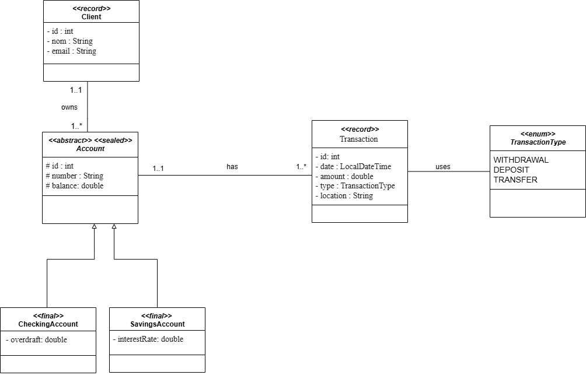

# 🏦 BankGuard Transaction Analyzer

<div align="center">


**Application Java d'analyse intelligente des transactions bancaires avec détection automatique d'anomalies**

[Fonctionnalités](#-fonctionnalités-clés) • [Installation](#-installation) • [Utilisation](#-utilisation) • [Architecture](#-architecture) • [Documentation](#-documentation)

</div>

---

## 📋 Table des matières

- [À propos](#-à-propos)
- [Fonctionnalités clés](#-fonctionnalités-clés)
- [Architecture](#-architecture)
- [Technologies utilisées](#-technologies-utilisées)
- [Prérequis](#-prérequis)
- [Installation](#-installation)
- [Configuration](#️-configuration)
- [Utilisation](#-utilisation)
- [Structure du projet](#-structure-du-projet)


---

## 🎯 À propos

**BankGuard Transaction Analyzer** est une application Java robuste conçue pour la gestion et l'analyse avancée des transactions bancaires. Elle offre une solution complète pour détecter les anomalies financières, générer des rapports détaillés et surveiller l'activité des comptes en temps réel.

### Contexte

Dans un environnement bancaire moderne, des milliers de transactions sont effectuées quotidiennement. BankGuard répond au besoin critique de :
- Centraliser et organiser les informations bancaires
- Détecter automatiquement les transactions suspectes
- Identifier les comptes inactifs et les comportements inhabituels
- Produire des rapports analytiques pour une meilleure prise de décision

---

## ✨ Fonctionnalités clés

### 🔐 Gestion des Clients
- Création, modification et suppression de clients
- Recherche avancée par ID ou nom
- Vue d'ensemble des soldes et comptes associés

### 💳 Gestion des Comptes
- Support de multiples types de comptes (Checking, Savings)
- Gestion du découvert autorisé et des taux d'intérêt
- Recherche et tri des comptes par divers critères
- Architecture sealed class pour une hiérarchie type-safe

### 💸 Analyse des Transactions
- Enregistrement de toutes les opérations (DEPOSIT, WITHDRAWAL, TRANSFER)
- Filtrage intelligent par montant, type, date et lieu
- Regroupement et agrégation des données avec Stream API
- Calcul automatique des moyennes et totaux
- Suivi des localisations géographiques

### 🚨 Détection d'Anomalies
- **Transactions à montant élevé** : Détection automatique au-delà d'un seuil configurable
- **Localisation suspecte** : Identification des opérations depuis des lieux inhabituels
- **Fréquence excessive** : Repérage des transactions multiples en très peu de temps
- **Comptes inactifs** : Alertes sur les comptes sans activité prolongée

### 📊 Rapports et Statistiques
- Top 5 des clients par solde total
- Rapports mensuels avec ventilation par type de transaction
- Analyse des volumes et tendances
- Détection des comptes inactifs
- Statistiques globales du système
- Interface console interactive avec formatage

---

## 🏗️ Architecture

BankGuard suit une **architecture en couches** respectant les principes SOLID :

```
┌─────────────────────────────────────┐
│     Couche Présentation (UI)       │
│         Menu Console                │
└─────────────────────────────────────┘
                  ↓
┌─────────────────────────────────────┐
│      Couche Services (Métier)       │
│  ClientService | AccountService     │
│  TransactionService | ReportService │
└─────────────────────────────────────┘
                  ↓
┌─────────────────────────────────────┐
│         Couche DAO (Accès Data)     │
│    ClientDAO | AccountDAO           │
│    TransactionDAO                   │
└─────────────────────────────────────┘
                  ↓
┌─────────────────────────────────────┐
│      Couche Entity (Modèle)         │
│  Client | Account | Transaction     │
│  (Records & Sealed Classes)         │
└─────────────────────────────────────┘
                  ↓
┌─────────────────────────────────────┐
│      Base de Données (JDBC)         │
│           PostgreSQL                │
└─────────────────────────────────────┘
```

### Principes de conception

- **Séparation des responsabilités** : Chaque couche a un rôle bien défini
- **Immutabilité** : Utilisation de `record` pour les entités
- **Hiérarchie fermée** : `sealed class` pour les types de comptes
- **Programmation fonctionnelle** : Stream API, Optional, Lambdas

---

## 🛠️ Technologies utilisées

| Technologie | Version | Usage |
|------------|---------|-------|
| **Java** | 17 | Langage principal avec Records, Sealed Classes, Pattern Matching |
| **JDBC** | 4.0+ | Persistance et accès aux données |
| **PostgreSQL** | 13+ | Base de données relationnelle |
| **Stream API** | Java 17 | Programmation fonctionnelle et traitement de données |
| **Git** | 2.x | Gestion de versions |

### Fonctionnalités Java 17 utilisées
- ✅ **Records** pour les entités immutables
- ✅ **Sealed Classes** pour la hiérarchie des comptes
- ✅ **Switch Expressions** pour la logique conditionnelle
- ✅ **Pattern Matching** pour le casting
- ✅ **Text Blocks** pour les requêtes SQL
- ✅ **var** pour l'inférence de type

---

## 📦 Prérequis

Avant de commencer, assurez-vous d'avoir installé :

- **Java JDK 17** ou supérieur
  ```bash
  java -version
  ```

- **PostgreSQL 13+**
  ```bash
  psql --version
  ```

- **Git** pour le clonage du projet
  ```bash
  git --version
  ```

- Un IDE Java (IntelliJ IDEA, Eclipse, VS Code avec extensions Java)

---

## 🚀 Installation

### 1. Cloner le repository

```bash
git clone https://github.com/votre-username/BankGuard-TransactionAnalyzer.git
cd BankGuard-TransactionAnalyzer
```

### 2. Créer la base de données

```sql
CREATE DATABASE bankguard_db;

-- Exécutez le script de création des tables :
\i sql/script.sql
```

### 3. Compiler le projet

```bash
# Compiler avec les dépendances PostgreSQL
javac -cp "lib/postgresql-42.7.8.jar" -d target/classes src/main/java/**/*.java
```

### 4. Exécuter l'application

```bash
# Avec Java et le classpath correct
java -cp "target/classes:lib/postgresql-42.7.8.jar" ui.Main
```

---

## ⚙️ Configuration

Créez un fichier `config.properties` à la racine du projet :

```properties
# Configuration Base de Données
db.url=jdbc:postgresql://localhost:5432/bankguard_db
db.username=votre_username
db.password=votre_password
db.driver=org.postgresql.Driver

```

> ⚠️ **Important** : Ne commitez jamais vos identifiants réels ! Utilisez `.env` ou `config.properties` (déjà dans .gitignore)

---

## 💻 Utilisation

### Lancer l'application

```bash
java -cp "target/classes:lib/postgresql-42.7.8.jar" ui.Main
```

### Menu principal

```
=== BankGuard Transaction Analyzer ===
1. Gestion des Clients
2. Gestion des Comptes
3. Gestion des Transactions
4. Rapports et Analyses
0. Quitter
```

### Exemples d'utilisation

#### Créer un client et un compte
```
> 1 (Gestion des Clients)
> 1 (Créer un client)
> Nom : Jean Dupont
> Email : jean.dupont@email.com
✓ Client créé avec succès (ID: 1)

> 2 (Gestion des Comptes)
> 1 (Créer un compte)
> ID Client : 1
> Type de compte : CHECKING
> Solde initial : 1000.00
> Découvert autorisé : 500.00
✓ Compte créé avec succès
```

#### Enregistrer une transaction
```
> 3 (Gestion des Transactions)
> 1 (Créer une transaction)
> ID du compte : 1
> Type de transaction : DEPOSIT
> Montant : 1500.00
> Localisation : Paris, France
✓ Transaction enregistrée avec succès
```

#### Analyser les transactions et détecter les anomalies
```
> 4 (Rapports et Analyses)
> 4 (Transactions suspectes)

=== TRANSACTIONS SUSPECTES DÉTECTÉES ===
Transactions à montant élevé (> 10000.0) :
- Transaction ID 15 : 25000.0 (2025-09-29)
- Transaction ID 23 : 15500.0 (2025-09-28)

Transactions avec localisation inhabituelle :
- Transaction ID 18 : Tokyo, Japan (Client habituel : Paris)
- Transaction ID 31 : New York, USA (Client habituel : Lyon)

> 5 (Comptes inactifs)
Comptes sans activité depuis plus de 30 jours :
- Compte ID 7 : Dernière transaction il y a 45 jours
```

---

## 📊 Diagramme de Classes UML

Le diagramme de classes ci-dessous illustre l'architecture complète du système BankGuard Transaction Analyzer, montrant les relations entre toutes les entités, services, et couches d'accès aux données.




## 📂 Structure du projet

```
BankGuard-TransactionAnalyzer/
│
├── 📁 src/main/java/
│   ├── 📁 entity/                  # Modèles de données (Records & Sealed Classes)
│   │   ├── 📁 client/
│   │   │   └── Client.java         # Record
│   │   ├── 📁 accounts/
│   │   │   ├── Account.java        # Sealed abstract class
│   │   │   ├── CheckingAccount.java
│   │   │   └── SavingsAccount.java
│   │   └── 📁 transactions/
│   │       └── Transaction.java    # Record
│   │
│   ├── 📁 dao/                     # Accès aux données
│   │   ├── ClientDAO.java
│   │   ├── AccountDAO.java
│   │   └── TransactionDAO.java
│   │
│   ├── 📁 service/                 # Logique métier
│   │   ├── ClientService.java
│   │   ├── AccountService.java
│   │   ├── TransactionService.java
│   │   └── ReportService.java
│   │
│   ├── 📁 ui/                      # Interface utilisateur
│   │   ├── Main.java               # Point d'entrée
│   │   └── Menu.java               # Menu console interactif
│   │
│   ├── 📁 util/                    # Utilitaires
│   │   ├── DatabaseConnection.java # Singleton de connexion
│   │   ├── DateUtil.java
│   │   └── ValidationUtil.java
│   │
│   └── 📁 enums/
│       └── TransactionType.java    # DEPOSIT, WITHDRAWAL, TRANSFER
│
├── 📁 sql/
│   └── script.sql                  # Structure complète de la BDD
│
├── 📁 uml/                         # Diagrammes UML
│
├── 📁 target/                      # Fichiers compilés (Maven/Gradle)
│
├── .gitignore
├── README.md
├── LICENSE
├── db.properties                   # Configuration BDD
└── db.properties.example           # Template de configuration
```

---


